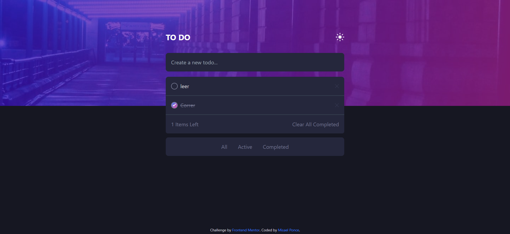

# Frontend Mentor - Todo app solution

This is a solution to the [Todo app challenge on Frontend Mentor](https://www.frontendmentor.io/challenges/todo-app-Su1_KokOW). Frontend Mentor challenges help you improve your coding skills by building realistic projects. 

## Table of contents

- [Overview](#overview)
  - [The challenge](#the-challenge)
  - [Screenshot](#screenshot)
  - [Links](#links)
- [My process](#my-process)
  - [Built with](#built-with)
  - [What I learned](#what-i-learned)
  - [Continued development](#continued-development)
  - [Useful resources](#useful-resources)
- [Author](#author)

## Overview

### The challenge

Users should be able to:

- View the optimal layout for the app depending on their device's screen size
- See hover states for all interactive elements on the page
- Add new todos to the list
- Mark todos as complete
- Delete todos from the list
- Filter by all/active/complete todos
- Clear all completed todos
- Toggle light and dark mode
- **Bonus**: Drag and drop to reorder items on the list (Still pending)

### Screenshot

### Links

- Solution URL: [Add solution URL here](https://your-solution-url.com)
- Live Site URL: [Add live site URL here](https://your-live-site-url.com)

## My process

### Built with

- Semantic HTML5 markup
- CSS custom properties
- Flexbox
- Mobile-first workflow
- [React](https://reactjs.org/) - JS library
- [Next.js](https://nextjs.org/) - React framework
- [Tailwind CSS](https://tailwindcss.com/) - For styles
- [UUID]((https://www.npmjs.com/package/uuid)) - For unique ID
- [react-beautiful-dnd]((https://github.com/atlassian/react-beautiful-dnd)) - For drag and drop functionality

### What I learned

The Todo App was a good challenge in which I learn more about how to work with the useState Hook and the use-local-storage
uuidv4 was very helpful to create unique id's

### Continued development

The drag and drop option is still pending as I'm still working on understandding how make it work but will keep it updated.

### Useful resources

- [UUID](https://www.npmjs.com/package/uuid) - To create unique ID's (uuid.v4()). Create a version 4 (random) UUID.
- [react-beautiful-dnd](https://github.com/atlassian/react-beautiful-dnd) - Very useful to add drag and drop functionality.

## Author

- Website - [Misael Ponce](https://portofolio-misaponce.vercel.app/)
- Frontend Mentor - [@Misaponce](https://www.frontendmentor.io/profile/Misaponce)
